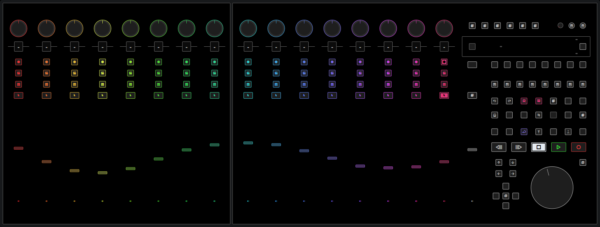

# cubase-mcu-midiremote

Cubase 12 MIDI Remote Scripts for DAW Controllers using the MCU Protocol

  

The following devices are explicitly supported:

- Behringer X-Touch / X-Touch Extender
- iCON QCon Pro G2 / QCon EX G2
- Mackie Control Universal Pro / XT Pro

Other MCU-compatible devices may work with any of these scripts, but their device surface is not explicitly displayed in Cubase.
Feel free to open a discussion on GitHub if you would like your MCU-like device to be supported.

## TL;DR

The Cubase MIDI Remote Scripts developed in this repository replace the default Mackie Control device setup for various MCU-like devices.
They can be [set up](#setup) with single standalone controllers or with an arbitrary combination of standalone and extender units.
The mapping is reasonably close to the default MCU mapping, with a few (workflow-)improving changes.
Nevertheless, you can easily re-map most control elements using Cubase's MIDI Remote Mapping Assistant.

## Motivation

Since version 12, Cubase supports the customized integration of MIDI controllers via a new MIDI Remote JavaScript API.
Several vendors are producing DAW controllers similar to the Mackie Control Universal (MCU) which are traditionally set up as Mackie Control devices in Cubase.
Creating MIDI Remote API scripts for these controllers allows to improve the mapping where applicable and offers users the possibility to override parts of it themselves via Cubase's MIDI Remote Mapping Assistant.

Some points for improvement of the default MCU mapping are:

- The main fader controls the first output channel's volume, not the Control Room volume.
- The meters do not seem to fully match the scale of the MixConsole meters.
- Bringing up the parameters of the currently focused plugin requires navigating through the list of insert slots with a push encoder.
- There is no single knob that can control any parameter under the mouse cursor, like in Steinberg's CC121 controller.

Moreover, some controllers have features that are not available with the default Mackie Control setup in Cubase.
For instance, the Behringer X-Touch has an individual, generously padded, RGB backlit scribble strip display per channel, as well as integrated LEDs in most buttons.
A MIDI Remote API script can illuminate these scribble strips according to their tracks' colors, avoid unnecessary display padding characters, and light up buttons while they are being pressed.

## About this Script

The MIDI Remote Scripts developed in this repository serve as full replacements for the default Mackie Control setup.
The mapping is similar to [Cubase's default Mackie MCU Pro mapping](https://download.steinberg.net/downloads_software/documentation/Remote_Control_Devices.pdf), with the following exceptions:

> **Note**
> In the rest of this document, all buttons except the six encoder assign buttons are referred to by their Cubase MCU mapping labels.
> I recommend using a Cubase overlay for your device, unless your device already has the Cubase labels printed on it, like the iCON QCon Pro G2.
> Alternatively, page 7 of [Cubase's remote control devices documentation](https://download.steinberg.net/downloads_software/documentation/Remote_Control_Devices.pdf) provides a Mackie MCU Pro overlay which you can use to figure out the Cubase button labels for your device.

**Encoder Assignments**

- The lower scribble strip row always shows track names since they are vital to using each channel's buttons and fader, regardless of the encoder assignment. Parameter page numbers are displayed on the otherwise unused two-digit Assignment display instead. If an encoder assignment only has one parameter page, the Assignment display remains blank.
- The "Track" encoder assignment has additional parameter pages for Low Cut, High Cut, and the Track Quick Controls of the selected track.
- Instead of spreading the "Send" encoder assignment options out on four parameter pages, there are only two pages now. The "Level" and "On" pages have been combined into a single page where turning encoders modifies the send level and pushing encoders toggles a send slot's On/Off status. The "Pre/Post" page remains untouched, and the "Bus" page is omitted because the MIDI Remote API doesn't expose send busses.
- The "Plug-In" encoder assignment always follows the currently focused plugin window to avoid tedious plugin selection via push encoders.
- The first page of the "Inst" encoder assignment maps encoders to the VST Quick Controls of the currently selected instrument track. The remaining pages map 8 encoders to each part of the channel strip, i.e., gate, compressor, tools, saturation, and limiter. Pushing an encoder toggles the bypass status of the corresponding channel strip plugin.

The table below summarizes all available encoder assignments:

<!-- prettier-ignore -->
| MCU button label | Cubase button label | Available parameter pages |
| --- | --- | --- |
| **Track** | First | <ol><li>Monitor</li><li>Pre Gain</li><li>Phase</li><li>Low-Cut Frequency / Enabled</li><li>High-Cut Frequency / Enabled</li><li>Selected Track Quick Controls</li></ol> |
| **Pan/Surround** | Pan | Pan |
| **EQ** | EQ | <ul><li>EQ Bands 1 & 2 (8 encoders)</li><li>EQ Bands 3 & 4 (8 encoders)</li></ul> |
| **Send** | Last | <ul><li>Send Levels / Enabled (8 encoders)</li><li>Send Pre/Post (8 encoders)</li></ul> |
| **Plug-In** | Plug-Ins | All Remote Control Editor parameter pages of the currently focused plugin (all encoders) |
| **Instrument** | Dyn/FX/Aux | <ul><li>Remote Control Editor parameters of the selected track's VST instrument (all encoders)</li><li>Channel Strip Gate (8 encoders)</li><li>Channel Strip Compressor (8 encoders)</li><li>Channel Strip Tools (8 encoders)</li><li>Channel Strip Saturation (8 encoders)</li><li>Channel Strip Limiter (8 encoders)</li></ul> |

**Buttons**

- Like in the MCU default mapping, the 8 channel type buttons apply MixConsole channel visibility presets 1-8. In the likely case that you don't want to waste 8 prominent buttons for loading visibility presets, feel free to re-assign some buttons in the MIDI Remote Mapping Assistant.
- The Channel Left/Right buttons below the Fader Bank buttons do not navigate between encoder parameter pages, but move the fader bank left/right by one channel. Navigating parameter banks can be achieved by pressing the respective Encoder Assign button multiple times to cycle through the available parameter pages in a round-robin fashion.
- Pressing "Shift + Edit" closes all **plugin** windows instead of only the currently active window (I couldn't find a command to "close the currently active window").
- The "Instrument" and "Master" buttons are assigned to the handy MixConsole History Undo and Redo commands, respectively. In the default MCU mapping, they would activate instrument and main insert effects encoder assignments. However, these can already be reached via the "Inst" and "Plug-In" encoder assign buttons, so I decided to use the buttons differently.
- For the same reason, the "Sends" button doesn't activate a send effects encoder assignment. Instead, it turns the rightmost push encoder and the jog wheel into controllers for the value that's currently under the mouse cursor – like the Steinberg CC121's AI knob.
- Pressing "Shift + Display Name/Value" flips the scribble strip display rows

**Miscellaneous**

- The main fader controls the Control Room volume unless the `mapMainFaderToControlRoom` [config option](#configuration-options) is set to `false`.

## Setup

- Make sure the firmware of your device(s) is up to date ([iCON QCon Pro G2](https://iconproaudio.com/product/qcon-pro-g2/) >= 1.13, [Behringer X-Touch](https://www.youtube.com/watch?v=Q4ZKXVXQP8g) >= v1.22 or scribble strip colors will not work)
- If your devices have multiple operation modes, select Mackie Control mode ([here's](https://www.youtube.com/watch?v=LrVWRgJbSyw&t=68s) how to do it on the X-Touch).
- Open up Cubase and ensure you are running version 12.0.52 or later
- In the studio setup window, remove any Mackie Control remote devices (don't forget to take screenshots of your command assignments). If you don't feel comfortable removing the devices, it is also fine to select "Not Connected" for their ports.
- Open the [latest GitHub release page](https://github.com/bjoluc/cubase-xtouch-midiremote/releases/latest) and in the "Assets" section, download the script (.js) that is named like your device.
- Open `C:\Users\<Username>\Documents\Steinberg\Cubase\MIDI Remote\Driver Scripts\Local` (Windows) or `/Users/<Username>/Documents/Steinberg/Cubase/MIDI Remote/Driver Scripts/Local` (MacOS).
- The filename of the script you downloaded has the form `<Device>_<Vendor>.js`. Cubase expects scripts to be nested in subdirectories named precisely after the script's vendor and device. So within the `Local` folder, create the subdirectories `<Device>/<Vendor>` according to the device and vendor portions of the script's filename. For instance, if you downloaded `behringer_xtouch.js`, the subdirectories would need to be `behringer\xtouch`.

  > **Note** Directory names matter. Make sure your subdirectory names precisely match the device and vendor components of the script filename, or Cubase might not recognize the script.

- Finally, move the script file into the newly created subdirectory and restart Cubase to pick up the script.

Cubase should automatically detect your device and enable it as a MIDI Remote.
If it doesn't, you can manually configure the MIDI Remote by clicking the "+" button in the lower zone's MIDI Remote pane.

## Setup with an extender unit

To use your device with an extender unit, follow the same steps as above, but edit the script file before restarting Cubase:
In the configuration options at the top of the file, replace `devices: ["main"]` with `devices: ["extender", "main"]` (or `devices: ["main", "extender"]` if you have your extender on the right side of the main device).

Then restart Cubase and configure the MIDI Remote by clicking the "+" button in the lower zone's MIDI Remote pane.

## Configuration Options

The very top of the MIDI Remote script file declares a number of configuration options.
You can edit these options to match your preferences.
Each option is documented in a comment above it.
For an overview of all options, please refer to the [source code on GitHub](https://github.com/bjoluc/cubase-xtouch-midiremote/blob/main/src/config.ts#L27-L54).

## Drawbacks

Current limitations of the MIDI Remote API:

- The "Track" encoder assignment is missing the "Input Bus" and "Output Bus" pages which are not exposed by the MIDI Remote API. I prefer to use the mouse for routing anyway, as opposed to a push encoder and a tiny single-row string on a scribble strip display.
- The "Pan/Surround" encoder assignment is missing a second page for vertical panning which is not exposed by the MIDI Remote API.
- The "Send" encoder assignment doesn't include a "Bus" page because send busses are not exposed by the MIDI Remote API.
- The "Plug-In" encoder assignment doesn't display the number of the active parameter page because it is not exposed by the MIDI Remote API.
- The "Inst" encoder assignment doesn't allow loading/switching channel strip plugins because the MIDI Remote API doesn't provide options for it.
- The punch button doesn't light up when "Auto Punch In" is activated – no host value available
- The global "Solo" LED and the "Solo Defeat" button don't light up when a channel is in solo mode – no host value available
- Channel visibility presets do not yet affect channel assignments since the `MixerBankZone` of the MIDI Remote API doesn't respect channel visibility presets (["`.setFollowVisibility()` is a teaser for future updates"](https://forums.steinberg.net/t/820531/2)).
- The function buttons F1-F8 can only have one assignment per button, no matter whether "Shift" is held or not ("Shift" activates a sub page and the Mapping Assistant doesn't consider sub pages)
- When controlling under-the-cursor values, the encoder's LED ring is not updated to single-dot mode but remains in whatever mode the currently active encoder assignment demands (blocked by https://forums.steinberg.net/t/831123).
